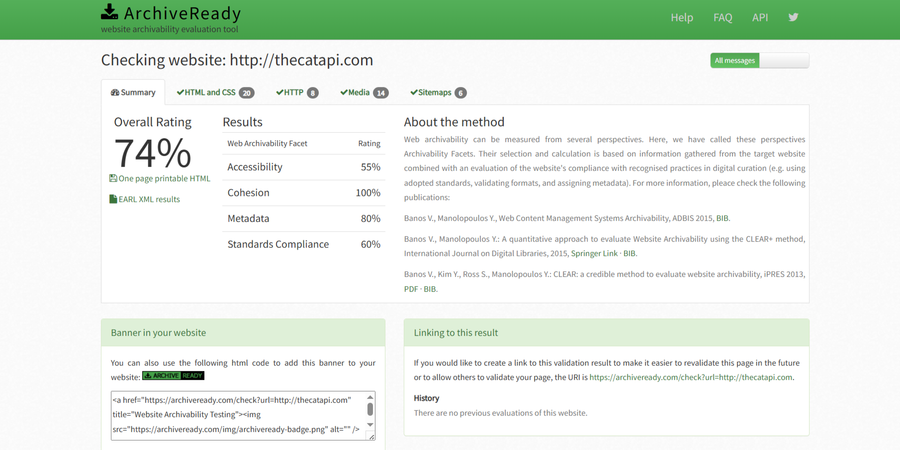
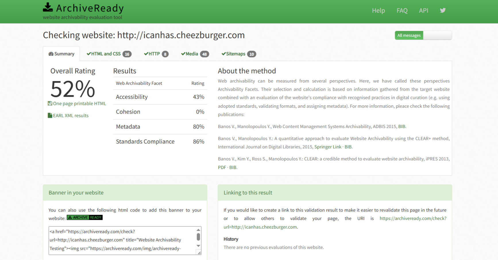
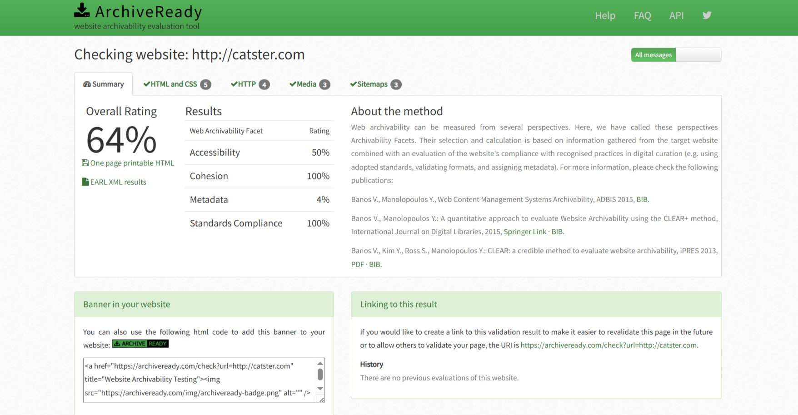

# Коллекция веб-архивов сайтов про кошек

## Список сайтов
- [thecatapi.com](https://thecatapi.com)
- [icanhas.cheezburger.com](https://icanhas.cheezburger.com)
- [catster.com](https://www.catster.com)

## Метод и технология
Архивирование выполнялось с помощью `wpull` в формат WARC.  
Проверка архивируемости через [ArchiveReady](https://archiveready.com/).  
Анализ метаданных проводился с помощью `metawarc`.

## Сводка анализа

| Сайт | Размер архива | Всего файлов | Основные типы контента |
|------|---------------|--------------|----------------------|
| thecatapi.com | 55,636,042 B | 689 | изображения (JPEG, GIF, PNG), HTML, JS, CSS |
| icanhas.cheezburger.com | 25,094,148 B | 160 | HTML, RSS, XML, текст |
| catster.com | 25,492,364 B | 541 | изображения (JPEG, PNG, SVG, WebP), HTML, JS, CSS |

## Подробные метаданные

### thecatapi.com
| MIME тип | Кол-во файлов | Размер (Б) | Доля (%) |
|----------|---------------|------------|----------|
| image/jpeg | 201 | 29,472,318 | 52.97 |
| image/gif | 19 | 10,981,011 | 19.74 |
| application/javascript | 81 | 6,579,186 | 11.83 |
| image/png | 12 | 5,715,198 | 10.27 |
| text/html | 271 | 2,087,938 | 3.75 |
| font/woff2 | 15 | 409,753 | 0.74 |
| text/css | 15 | 163,027 | 0.29 |
| ... | ... | ... | ... |
| **Всего** | 689 | 55,636,042 | 100 |

### icanhas.cheezburger.com
| MIME тип | Кол-во файлов | Размер (Б) | Доля (%) |
|----------|---------------|------------|----------|
| text/html | 154 | 24,854,486 | 99.04 |
| application/rss+xml | 4 | 237,624 | 0.95 |
| text/xml | 1 | 1,228 | 0.0049 |
| text/plain | 1 | 810 | 0.0032 |
| **Всего** | 160 | 25,094,148 | 100 |

### catster.com
| MIME тип | Кол-во файлов | Размер (Б) | Доля (%) |
|----------|---------------|------------|----------|
| image/jpeg | 175 | 14,108,824 | 55.35 |
| image/png | 31 | 4,995,314 | 19.60 |
| text/html | 203 | 4,193,746 | 16.45 |
| application/javascript | 83 | 969,613 | 3.80 |
| image/svg+xml | 18 | 844,054 | 3.31 |
| text/css | 14 | 119,893 | 0.47 |
| image/webp | 8 | 38,982 | 0.15 |
| ... | ... | ... | ... |
| **Всего** | 541 | 25,492,364 | 100 |

### Скриншоты анализа

#### thecatapi.com

#### icanhas.cheezburger.com

#### catster.com

## Особенности сайтов
- **thecatapi.com:** API для изображений кошек, основной контент — изображения  
- **icanhas.cheezburger.com:** развлекательный контент, мемы, GIF  
- **catster.com:** статьи о породах кошек, медиа-контент

## Авторство
София Филимонова, safilimonova@edu.hse.ru

## Лицензия
Открытая лицензия CC-BY 4.0
